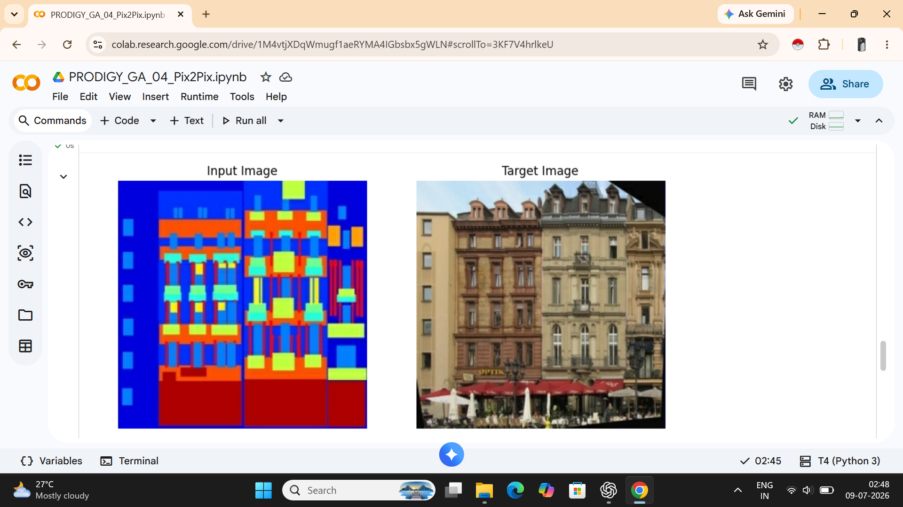
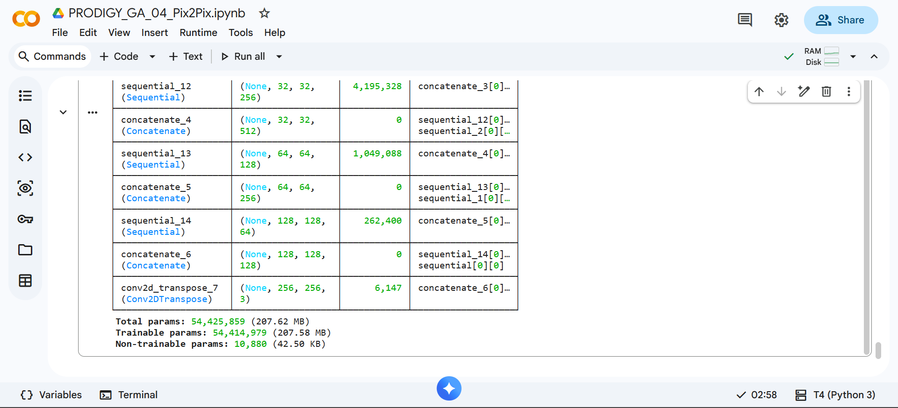
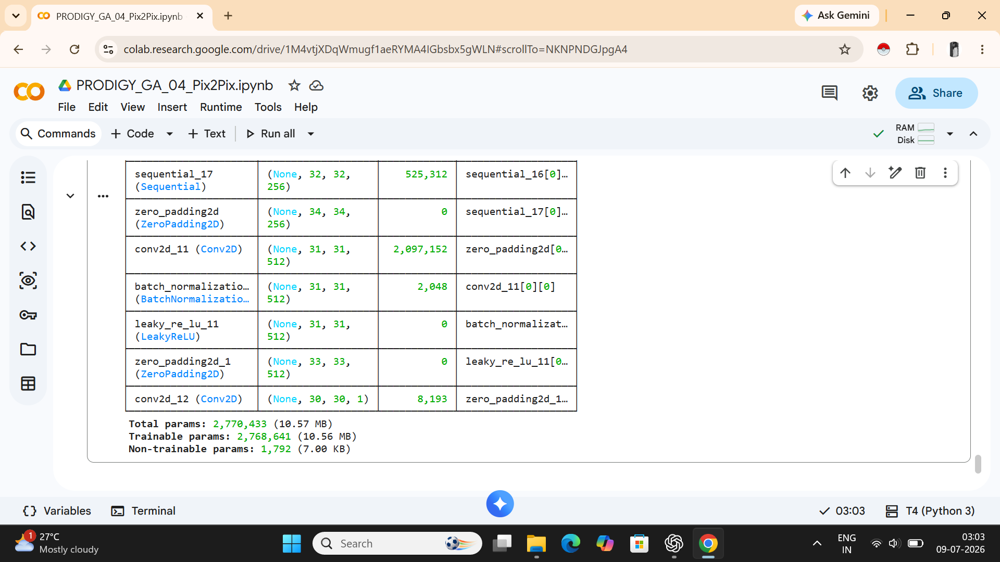
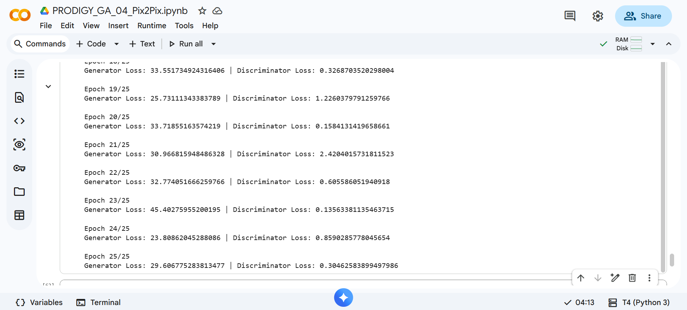
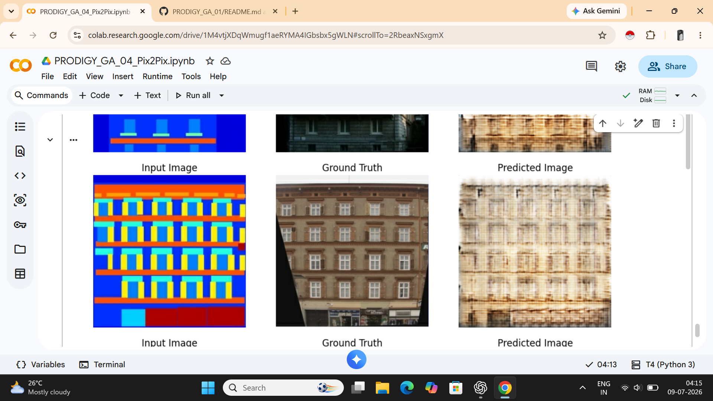

# PRODIGY_GA_04

## Task 04 - Generative AI Internship @ Prodigy InfoTech

## Image-to-Image Translation using Conditional GAN (pix2pix)

### Overview

This project demonstrates image-to-image translation using Pix2Pix, a Conditional Generative Adversarial Network (cGAN).

The model was trained on the Facades Dataset, where architectural label maps are translated into realistic building facade images. Pix2Pix learns the mapping between structured input images and corresponding real-world photographs through adversarial training.

---

## Project Objective

Generate realistic building facade images from semantic label maps using the Pix2Pix image-to-image translation framework.

---

## Features

- Image-to-image translation using Pix2Pix
- Conditional GAN (cGAN) implementation
- U-Net Generator architecture
- PatchGAN Discriminator architecture
- Trained on paired facade image data
- Implemented in Google Colab

---

## Dataset

### Facades Dataset

The Facades Dataset contains paired images:

- Input Image: Semantic facade labels
- Target Image: Real building photographs

Dataset Structure:

- Train Images: 400
- Test Images: 106

---

## Technologies Used

- Python
- TensorFlow
- Keras
- Google Colab
- Pix2Pix (Conditional GAN)

---

## Model Architecture

### Generator

The Generator uses a U-Net architecture with skip connections to preserve spatial information while generating realistic facade images.

### Discriminator

The Discriminator uses a PatchGAN architecture that classifies local image patches as real or fake, improving image quality and structural consistency.

---

## Training

The model was trained for 25 epochs on the Facades Dataset.

Training Loss Examples:

- Generator Loss: 29.60
- Discriminator Loss: 0.30

The Generator progressively learned facade structures, windows, floors, and architectural layouts from semantic maps.

---

## Project Workflow

1. Loaded and preprocessed the Facades Dataset.
2. Split images into input-label and target-photo pairs.
3. Built the U-Net Generator model.
4. Built the PatchGAN Discriminator model.
5. Trained the Pix2Pix network using adversarial learning.
6. Generated facade images from semantic label maps.
7. Evaluated the generated outputs.

---

## Results

The trained Pix2Pix model successfully generated building facade images from semantic label maps.

Although fine image details remain blurred due to limited training epochs, the model learned overall building structures, window placements, and facade layouts.

---

## Screenshots

### Input and Target Images

### Generator (U-Net) Architecture

### Discriminator (PatchGAN) Architecture

### Training Progress

### Prediction Result

---

## Repository Structure

PRODIGY_GA_04
│
├── screenshots/
│   ├── task4_input_target_image.png
│   ├── task4_generator_unet.png
│   ├── task4_discriminator_model.png
│   ├── task4_training_epochs.png
│   └── task4_prediction_result.png
│
├── .gitignore
├── PRODIGY_GA_04_Pix2Pix.ipynb
├── requirements.txt
├── README.md
└── LICENSE

---
